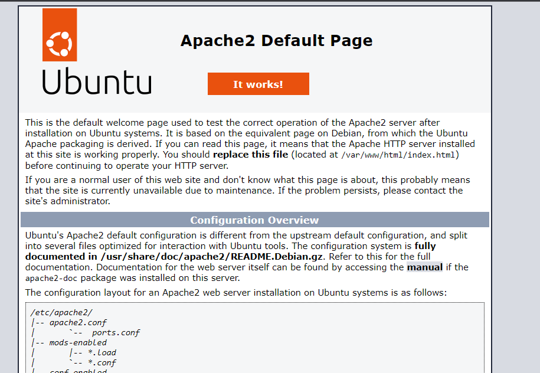

# Setup Apache HTTP Server With Shorts Security Best Practice
![Hits][hits-button]

[hits-button]: https://hits.seeyoufarm.com/api/count/incr/badge.svg?url=https%3A%2F%2Fgithub.com%2Fpassword123456%2Fsetup-apache-http-server-with-shorts-security-best-practice&count_bg=%2379C83D&title_bg=%23555555&icon=&icon_color=%23E7E7E7&title=hits&edge_flat=false

Apache HTTP Server is an older web server, and there are already numerous resources available on security hardening and best practices. Despite the abundance of security hardening guides, many Apache HTTP Servers still suffer from security misconfigurations.

This document revisits the essential security configurations for Apache HTTP Server from a practical perspective.

By following the key recommendations outlined below, you can avoid common configuration errors and prevent security vulnerabilities caused by improper Apache Directive Configurations.

If you find this helpful, please the **"star"**:star2: to support further improvements.

***
## Table of Contents
- [1. Ensure Proper Permissions for Apache Process Account](#1-ensure-proper-permissions-for-apache-process-account)
- [2. Ensure Apache Version Information is Not Exposed](#2-ensure-apache-version-information-is-not-exposed)
- [3. Ensure Unnecessary Modules Are Disabled](#3-ensure-unnecessary-modules-are-disabled)
- [4. Set Proper Permissions for Critical Directories and Files](#4-set-proper-permissions-for-critical-directories-and-files)
- [5. Remove Unnecessary Default Configurations](#5-remove-unnecessary-default-configurations)
- [6. Use Correct Web Server Configuration Directives](#6-use-correct-web-server-configuration-directives)
- [7. Disabling Unused HTTP Methods](#7-disabling-unused-http-methods)
- [8. Ensure Removal of Insecure and Outdated SSL Protocols and Ciphers](#8-ensure-removal-of-insecure-and-outdated-ssl-protocols-and-ciphers)
- [9. Ensure Proper Permissions on SSL Certificate Files](#9-ensure-proper-permissions-on-ssl-certificate-files)
- [10. Ensure Blocking of Arbitrary Host Connections Not Configured in the Web Server](#10-ensure-blocking-of-arbitrary-host-connections-not-configured-in-the-web-server)
- [11. Inspection and Control of Request Headers](#11-inspection-and-control-of-request-headers)

***

## 1. Ensure Proper Permissions for Apache Process Account
Apache HTTP Server typically runs under the default `apache` user account (or another non-privileged account). 

It is important to ensure that Apache is not running under a privileged account, such as `root`. If it is, it must be changed to a non-privileged user to prevent potential security risks.

**Audit:**
- Verify the current user account under which Apache is running, execute the following command:
    ```
    [root@localhost ~]# ps -ef | grep httpd
    root      1234     1  0 12:00 ?        00:00:01 /usr/sbin/httpd -k start
    apache    1235  1234  0 12:00 ?        00:00:00 /usr/sbin/httpd -k start
    apache    1236  1234  0 12:00 ?        00:00:00 /usr/sbin/httpd -k start
    apache    1237  1234  0 12:00 ?        00:00:00 /usr/sbin/httpd -k start
    apache    1238  1234  0 12:00 ?        00:00:00 /usr/sbin/httpd -k start
    ```

**Remediation:**
- If Apache is running under the `root` account or any other account with elevated privileges, modify the configuration to run under a non-privileged account such as `apache`, `nobody`, `daemon`:
    ```
    [root@localhost ~]# vim /etc/httpd/httpd.conf
    User apache   # <== Set to a non-privileged account e.g. apache, nobody, daemon
    Group apache  # <== Group associated with the user
    Ensure the Apache process account has no unnecessary privileges:
    ```
**(1) Check sudo privileges:** 
- The Apache process account must not have sudo privileges:
    ```
    [root@localhost ~]# sudo -l -U apache
    User apache is not allowed to run sudo on pg-sec-mqrelay01
    ```
**(2) Verify shell access:** 
- The Apache process account should not have access to a login shell:
    ```
    [root@localhost ~]# cat /etc/passwd | grep -i apache
    apache:x:48:48:Apache:/var/www:/sbin/nologin
    ```
**(3) Ensure password is locked:** 
- The password for the Apache process account should be locked:
    ```
    [root@localhost ~]# passwd -S apache
    apache LK 2023-10-16 -1 -1 -1 -1 (Password locked.)
    ```

## 2. Ensure Apache Version Information is Not Exposed
By default, Apache HTTP Server displays the version information in the HTTP response header. This can provide attackers with insights into potential vulnerabilities. Hiding the version information mitigates this risk.

**Audit:**
- Verify that Apache version information is exposed in the HTTP response header:
    ```
    [root@localhost ~]# curl -i -k http://127.0.0.1
    HTTP/1.1 200 OK
    Date: Tue, 20 Aug 2024 12:34:56 GMT
    Server: Apache/2.4.57 (Rocky Linux)
    ...
    ```

**Remediation:**
- To prevent the version information from being exposed, modify the following settings in the Apache configuration:
    ```
    [root@localhost ~]# vim /etc/httpd/httpd.conf
    ...
    ServerTokens Prod   # <== Set to hide version information
    ServerSignature Off # <== Disable the server signature
    ```

## 3. Ensure Unnecessary Modules Are Disabled
Apache HTTP Server includes a number of modules by default. Unless explicitly specified during installation, all modules are installed and activated. Unused modules consume system resources and can introduce security vulnerabilities if improperly configured. Only enable the modules required by your service to minimize risk and resource usage.

Here are some common Apache modules, along with their functions and typical use cases:

| **Module**      | **Function**                                                        | **Usage Example**                                                 |
|-----------------|---------------------------------------------------------------------|-------------------------------------------------------------------|
| mod_so          | Supports dynamic loading of modules.                                | Load necessary modules only when needed.                          |
| mod_ssl         | Enables SSL/TLS encryption for HTTPS.                               | Required for securing sites with HTTPS.                           |
| mod_rewrite     | Provides URL rewriting functionality.                               | Redirect URLs or support virtual URL structures.                  |
| mod_proxy       | Provides proxy features for various protocols (HTTP, HTTPS, FTP).   | Used for reverse proxy or gateway configurations.                 |
| mod_deflate     | Compresses content before sending it to the client.                 | Improves performance and reduces bandwidth usage.                 |
| mod_cache       | Caches content to enhance server performance.                       | Reduces load by caching frequently accessed data.                 |
| mod_include     | Supports Server Side Includes (SSI) for dynamic HTML.               | Insert conditional text or file content into HTML.                |
| mod_cgi         | Supports CGI scripts for dynamic content.                           | Required for running scripts in Perl, Python, etc.                |
| mod_status      | Provides monitoring and statistics on the server’s current status.  | Monitors Apache’s real-time status.                               |
| mod_userdir     | Enables user-specific web directories.                              | Allows users to host their own content in their home directories. |
| mod_alias       | Maps URL patterns to different paths.                               | Redirect URLs or map folders to web roots.                        |
| mod_auth_basic  | Provides basic HTTP authentication (username/password).             | Enables basic authentication on web pages.                        |
| mod_auth_digest | Provides more secure MD5-based digest authentication.               | Used for more secure authentication methods.                      |
| mod_authz_host  | Controls access based on host.                                      | Restricts access based on IP addresses or domains.                |
| mod_autoindex   | Automatically generates directory listings.                         | Displays file lists when no index file is available.              |
| mod_negotiation | Provides content negotiation to serve the most appropriate content. | Chooses the best version of content for the client.               |
| mod_mime        | Determines the MIME type based on file extension.                   | Sends the correct MIME type based on file type.                   |
| mod_log_config  | Allows customized log formats.                                      | Used to configure specific logging formats.                       |
| mod_setenvif    | Sets environment variables based on request headers.                | Alters behavior based on certain conditions.                      |
| mod_headers     | Modifies HTTP response headers.                                     | Adjusts headers for security and client behavior.                 |


**Audit:**
- Verify that unnecessary modules are enabled in your environment:
    ```
    [root@localhost ~]# httpd -M
    Loaded Modules:
     core_module (static)
     so_module (static)
     http_module (static)
     mpm_prefork_module (shared)
     authn_file_module (shared)
     authz_host_module (shared)
     authz_core_module (shared)
     ...
    ```
- **Modules Typically Needed for Web Services:** Common modules used in most web environments:
    ```
    mod_so, mod_ssl, mod_rewrite, mod_proxy, mod_deflate, mod_headers, mod_mime, mod_log_config, mod_setenvif, mod_authz_host, mod_dir, mod_alias
    ```
- **Modules Not Typically Needed:** Modules that are less commonly used or that pose potential security risks if misconfigured:
    ```
    mod_autoindex, mod_userdir, mod_status, mod_info, mod_include, mod_cgi, mod_proxy, mod_negotiation
    ```

**Remediation:**
- Disable unnecessary modules to reduce the attack surface.

**(1) Disable with ./configure (source installation only):** 
- If you compiled Apache from source, disable modules using the ./configure command:
    ```
    ex) ./configure --disable-module_name
    
    [root@localhost ~]# ./configure --disable-autoindex
    [root@localhost ~]# ./configure --disable-auth-digest
    ...
    ```

**(2) Disable by commenting out LoadModule directives:** 
- This is the common method for disabling modules. Edit the Apache configuration file and comment out the relevant LoadModule directives:
    ```
    [root@localhost ~]# vim /etc/httpd/httpd.conf
    ...
    LoadModule status_module modules/mod_status.so
    LoadModule log_config_module modules/mod_log_config.so
    # LoadModule status_module modules/mod_status.so  # <== Disable by adding a comment
    ```

## 4. Set Proper Permissions for Critical Directories and Files
Ensure that the Apache installation directory and configuration files are accessible only to the "root" user. The permissions for these directories and files should be checked and modified if any other users have access rights.

**Audit:**
- Verify the permissions of Apache's installation directory and configuration files.
    ```
    [root@localhost ~]# ls -al /etc/httpd/
    total 16
    drwxr-xr-x.  5 root root  4096 Aug 20 12:00 .
    drwxr-xr-x. 77 root root  4096 Aug 20 12:00 ..
    drwxr-xr-x.  2 root root  4096 Aug 20 12:00 conf
    drwxr-xr-x.  2 root root  4096 Aug 20 12:00 conf.d
    drwxr-xr-x.  2 root root  4096 Aug 20 12:00 conf.modules.d
    lrwxrwxrwx.  1 root root    19 Aug 20 12:00 logs -> ../../var/log/httpd
    lrwxrwxrwx.  1 root root    29 Aug 20 12:00 modules -> ../../usr/lib64/httpd/modules
    lrwxrwxrwx.  1 root root    14 Aug 20 12:00 run -> /run/httpd
    ```

**Remediation:**
- Ensure that all Apache directories and configuration files are owned by `root:root`.
- Adjust the permissions so that others (non-owners) cannot access the directories and files.
    ```
    [root@localhost ~]# chown root:root -R /etc/httpd
    [root@localhost ~]# chmod o-rx -R /etc/httpd
    ```

## 5. Remove Unnecessary Default Configurations
By default, Apache creates several example configuration files during installation. These files are included in the initial setup, and when adding additional configurations, they can conflict with or override new settings, potentially causing unexpected behavior or security vulnerabilities.

**Apache Default Page:**


To avoid complications in server configurations, remove unused default configuration files and ensure that any active configurations are placed in appropriate locations without causing conflicts.

**Default Configuration Files and Content:**

| **File Name**  | **Location**                          | **Content**                                                                 |
|----------------|---------------------------------------|-----------------------------------------------------------------------------|
| welcome.conf   | /etc/httpd/conf.d/welcome.conf        | Apache default welcome page configuration.                                  |
| autoindex.conf | /etc/httpd/conf.d/autoindex.conf      | Automatically generates directory listings.                                 |
| README         | /etc/httpd/conf.d/README              | Readme file generated during installation (not related to Apache settings). |
| userdir.conf   | /etc/httpd/conf.d/userdir.conf        | Configuration for user home directories serving web content.                |
| 00-dav.conf    | /etc/httpd/conf.modules.d/00-dav.conf | Configuration related to the WebDAV module.                                 |
| 01-cgi.conf    | /etc/httpd/conf.modules.d/01-cgi.conf | Default CGI script configuration.                                           |

**Audit:**
- Check for the presence of default configuration files that are not being used.

**Remediation:**
- Remove the default configuration files such as `welcome.conf`, `autoindex.conf`, `README`, `00-dav.conf`, `01-cgi.conf`.
- Ensure that any active configurations do not override each other and are applied correctly with proper syntax and placement.


## 6. Use Correct Web Server Configuration Directives
Another common cause of Apache vulnerabilities is the `incorrect use of configuration directives.` 

Directives in Apache are commands that control the behavior or settings of the server, and they must be applied correctly to avoid security risks. 

You can find a full list of Apache directives here: [Apache Directive Documentation](https://httpd.apache.org/docs/2.2/ko/mod/directives.html)

When configuration directives are misused, you may encounter issues such as overlapping settings, configuration overrides, or vulnerabilities caused by improperly segregating global and virtual host settings. 

Below are some examples of configuration vulnerabilities due to improper use of directives.

**A Few Examples of Misconfigurations Leading to Vulnerabilities:**

**(1) AllowOverride Vulnerability via .htaccess**
- If `.htaccess` usage is disabled globally (with AllowOverride None), but re-enabled in a virtual host (with AllowOverride All), attackers could upload malicious `.htaccess` files and manipulate server behavior.
    ```
    [root@localhost ~]# vim /etc/httpd/httpd.conf
    ...
    <Directory "/var/www">
        AllowOverride None
    </Directory>
    ...
    
    <VirtualHost *:80>
        ServerName example.com
        DocumentRoot "/var/www/example"
        <Directory "/var/www/example">
            AllowOverride All
        </Directory>
    </VirtualHost>
    ```

**(2) System-Wide Directory Access Vulnerability via Directory Setting**
- Allowing global access to the root directory ( `<Directory "/"> Require all granted` ) while applying specific directory restrictions in a virtual host can allow unauthorized access to the entire server directory tree.
    ```
    [root@localhost ~]# vim /etc/httpd/httpd.conf
    ...
    <Directory "/">
        Require all granted
    </Directory>
    ...
    
    <VirtualHost *:80>
        ServerName example.com
        DocumentRoot "/var/www/example"
        <Directory "/var/www/example">
            Options None
            Require all granted
        </Directory>
    </VirtualHost>
    ```

**(3) DocumentRoot Vulnerability**
- A global `DocumentRoot "/"` setting exposes the entire server directory tree if not correctly overridden in a virtual host, leading to similar directory access vulnerabilities.
    ```
    [root@localhost ~]# vim /etc/httpd/httpd.conf
    ...
    DocumentRoot "/"
    ...
    
    <VirtualHost *:80>
        ServerName example.com
        DocumentRoot "/var/www/example"
        <Directory "/var/www/example">
            Options None
            Require all granted
        </Directory>
    </VirtualHost>
    ```

**(4) ExecCGI Misconfiguration**
- Setting `Options +ExecCGI` globally but disabling it within a virtual host could inadvertently allow CGI execution globally if the global setting takes precedence.
    ```
    [root@localhost ~]# vim /etc/httpd/httpd.conf
    ...
    <Directory "/var/www">
        Options +ExecCGI
        Require all granted
    </Directory>
    ...
    
    <VirtualHost *:80>
        ServerName example.com
        DocumentRoot "/var/www/example"
        <Directory "/var/www/example">
            Options None
            Require all granted
        </Directory>
    </VirtualHost>
    ```

**(5) DirectoryIndex Vulnerability**
- When the global `DirectoryIndex` is not removed, and a different `DirectoryIndex` is set for a virtual host, the global index setting could lead to unintended directory listings if no index file is found.
    ```
    [root@localhost ~]# vim /etc/httpd/httpd.conf
    ...
    DirectoryIndex index.html
    ...
    
    <VirtualHost *:80>
        ServerName example.com
        DocumentRoot "/var/www/example"
        DirectoryIndex index.php
    </VirtualHost>
    ```

**Audit:**
- Verify that directives are correctly applied in both global and virtual host configurations.
- Ensure that directives are not used multiple times in conflicting ways across global and virtual host contexts.

**Remediation:**
- Segregate web server configurations between global settings and virtual host settings.
- Ensure that directives, if repeated, are properly scoped according to the context (global vs. virtual host).

**Best Practices for Commonly Repeated Directives:**

| Directive              | Recommended Configuration                                                       |                                                 
|------------------------|---------------------------------------------------------------------------------|
| DocumentRoot           | 	Apply only within individual virtual hosts, avoid using globally.              |
| DirectoryIndex         | 	Apply only to virtual hosts that require a custom index; do not set globally.  |
| Timeout	               | Apply timeout settings only to specific virtual hosts that require them.        | 
| AllowOverride          | 	Restrict .htaccess usage to specific directories only, do not allow globally.  |
| Options                | 	Define options such as ExecCGI, Indexes, etc. separately for each directory.   |
| Require                | 	Apply access restrictions within each <Directory> block for precision control. |
| Redirect / RewriteRule | 	Only apply in virtual hosts where URL redirection or rewrite rules are needed. |

**Correct Use of Match Directives:**
- Directives that `include Match` (e.g., `DirectoryMatch`, `FilesMatch`, `LocationMatch`) use regular expressions or patterns to apply precise configurations.
- Directives that `not include Match` (e.g., `Directory`, `Files`, `Location`) apply settings to specified paths or files.
- `Match` directives = precise pattern matching / `Non-Match` directives = broader range matching.
- It's important to understand the characteristics of each directive to prevent misconfigurations and unintended behavior.


**(1) DirectoryMatch**
- Restrict access only to /var/www/test and /var/www/dev directories.
    ```
    <DirectoryMatch "^/var/www/(test|dev)">
        Require all denied
    </DirectoryMatch>
    ```

**(2) FilesMatch**
- Apply settings only to .cgi or .pl files.
    ```
    <FilesMatch "\.(cgi|pl)$">
        Require all granted
    </FilesMatch>
    ```

**(3) LocationMatch**
- Apply settings to all URLs under /secure/.
    ```
    <LocationMatch "^/secure/.*">
        Require valid-user
    </LocationMatch>
    ```

**(4) Files**
- Apply settings only to the important.txt file.
    ```
    <Files "important.txt">
        Require all denied
    </Files>
    ```

**(5) Location**
- Apply settings to all URLs starting with /admin.
    ```
    <Location "/admin">
        Require admin
    </Location>
    ```

## 7. Disabling Unused HTTP Methods
When unused HTTP methods are enabled on a web service, they can expose vulnerabilities or unintended behaviors that may lead to abuse and become an attack vector. 

It is important to disable any methods that are not in use, particularly the `TRACE` method, which is used for debugging and is generally unnecessary for normal web service operations.

**HTTP Methods:**

| Name    | Description                                                                                                                                         |
|---------|-----------------------------------------------------------------------------------------------------------------------------------------------------|
| OPTIONS | 	Used to check the list of supported methods by the web server.                                                                                     |
| HEAD    | 	The server sends only the header information in the response. It is often used to check the existence of a page by receiving the HTTP status code. |
| GET     | 	Similar to POST, but does not handle form input; typically used to retrieve information such as lists in forums via URI transmission.              |
| POST    | 	Used when sending data from a client to a web application for processing.                                                                          |
| PUT     | 	Similar to POST, used to save content specified by the client to the server.                                                                       |
| DELETE  | 	Used by the client to delete files on the server.                                                                                                  |
| TRACE   | 	Used to invoke a loopback message on the web server to trace the data transmission path.                                                           |
| CONNECT | 	Used to request proxy functionality from the web server.                                                                                           |


**Audit:**
- Verify that which HTTP methods are available on your web server:
    ```
    [root@localhost ~]# curl -i -k -X OPTIONS http://example.com
    HTTP/1.1 200 OK
    Server: Apache
    Date: Mon, 12 Aug 2024 03:00:29 GMT
    Content-Type: text/html; charset=utf-8
    Content-Length: 0
    Connection: keep-alive
    Allow: GET, HEAD, OPTIONS, PUT, DELETE, POST, PATCH
    ...
    ```

**Remediation:**
- Disable TRACE Method
    ```
    [root@localhost ~]# vim /etc/httpd/httpd.conf
    ...
    TraceEnable Off  # <== Disable TRACE method
    ```
- Enable Only Necessary HTTP Methods:
    ```
    [root@localhost ~]# vim /etc/httpd/httpd.conf
    ...
    TraceEnable Off  # <== Disable TRACE method
    ...
    <VirtualHost *:80>
        ServerName example.com
        DocumentRoot "/var/www/example"
        ...
        # Only allow GET, POST, and OPTIONS methods; deny others with HTTP 403 response.
        <Location "/">
            <LimitExcept GET POST OPTIONS>
                Require all denied
            </LimitExcept>
        </Location>
        ...
    </VirtualHost>
    ```

**LimitExcept Directive:**
- The LimitExcept directive can be used in various configuration sections, such as `<Directory>`, `<Location>`, `<Files>`, `<Proxy>`, `<LocationMatch>`, `<DirectoryMatch>`.
- Below are some examples:
    ```
    <LocationMatch "^/private">
        <LimitExcept GET POST OPTIONS>
            Require all denied
        </LimitExcept>
    </LocationMatch>
    
    
    <Proxy "*">
        <LimitExcept GET POST OPTIONS>
            Require all denied
        </LimitExcept>
    </Proxy>
    
    <Files "secret.txt">
        <LimitExcept GET POST OPTIONS>
            Require all denied
        </LimitExcept>
    </Files>
    
    
    <Location "/admin">
        <LimitExcept GET POST OPTIONS>
            Require all denied
        </LimitExcept>
    </Location>
    
    
    <Directory "/var/www/html">
        <LimitExcept GET POST OPTIONS>
            Require all denied
        </LimitExcept>
    </Directory>
    ```

## 8. Ensure Removal of Insecure and Outdated SSL Protocols and Ciphers
When configuring SSL, outdated and insecure protocols or algorithms should be avoided. 

Major browsers like Chrome, Microsoft Edge, and Firefox have dropped support for TLS 1.0 and TLS 1.1 due to security vulnerabilities such as POODLE and BEAST. These older protocols are known to be vulnerable to various attacks.

| No. | CVE-ID        | Vulnerability Name                                      | Description                                                                |
|-----|---------------|---------------------------------------------------------|----------------------------------------------------------------------------|
| 1   | CVE-2014-3566 | POODLE (Padding Oracle On Downgraded Legacy Encryption) | Exploits outdated encryption methods, enabling protocol downgrade attacks. |
| 2   | CVE-2011-3389 | BEAST (Browser Exploit Against SSL/TLS)                 | Allows attackers to decrypt HTTPS cookies and hijack sessions.             |


**Audit:**
- Verify the SSL settings for `SSLProtocol` and `SSLCipherSuite` configurations.
    ```
    [root@localhost ~]# vim /etc/httpd/httpd.conf
    ...
    <VirtualHost *:443>
        ServerName example.com
        DocumentRoot "/var/www/example"
        SSLEngine on
        SSLCertificateFile "/etc/httpd/conf.d/cert/example.com_ssl.crt"
        SSLCertificateKeyFile "/etc/httpd/conf.d/cert/example.com_ssl.key"
        SSLCertificateChainFile "/etc/httpd/conf.d/cert/example.com_ssl-chain.crt" 
        SSLProtocol all
        SSLCipherSuite ALL:!ADH:!EXPORT:!LOW
        SSLHonorCipherOrder on
        <Directory "/var/www/example">
            Options None
            AllowOverride None
            Require all granted
        </Directory>
        ...
    </VirtualHost>
    ```

**Remediation:**
- `SSLProtocol` should use TLS 1.2 or later.
- `SSLCipherSuite` to utilize secure algorithms supported in TLS 1.2 or later.

**Recommended Configuration (General Use):**
- For general services (not bound by PCI-DSS), use the following configuration:
    ```
    SSLProtocol     all -SSLv3 -TLSv1 -TLSv1.1
    SSLCipherSuite  ECDHE-ECDSA-AES128-GCM-SHA256:ECDHE-RSA-AES128-GCM-SHA256:ECDHE-ECDSA-AES256-GCM-SHA384:ECDHE-RSA-AES256-GCM-SHA384:ECDHE-ECDSA-CHACHA20-POLY1305:ECDHE-RSA-CHACHA20-POLY1305:DHE-RSA-AES128-GCM-SHA256:DHE-RSA-AES256-GCM-SHA384:DHE-RSA-CHACHA20-POLY1305
    ```
- After configuration, verify the SSL security status using [SSL Labs' SSL Test.](https://www.ssllabs.com/ssltest/)
- Refer to [Mozilla's SSL Configuration Generator](https://ssl-config.mozilla.org/) for specific configurations based on your web server and OpenSSL version.

## 9. Ensure Proper Permissions on SSL Certificate Files
In cases where a web service vulnerability allows remote access to web server permissions, attackers may attempt to access SSL certificate files, potentially leading to the exposure of the private key. If the SSL certificate's private key is leaked, an attacker could create a spoofed website that appears legitimate or use the key to distribute malware. This becomes especially dangerous when SSL certificate pinning is used, or if the certificate is a wildcard certificate, as it could necessitate replacing certificates across all servers and clients.

Ensure that SSL certificate files are secured by verifying and applying proper file permissions.

**Audit:**
- Verify the file ownership and permissions for the `SSLCertificateFile`, `SSLCertificateKeyFile`, `SSLCertificateChainFile` files.
    ```
    [root@localhost ~]# vim /etc/httpd/httpd.conf
    ...
    <VirtualHost *:443>
        ServerName example.com
        DocumentRoot "/var/www/example"
        SSLEngine on
        SSLCertificateFile "/etc/httpd/conf.d/cert/example.com_ssl.crt"
        SSLCertificateKeyFile "/etc/httpd/conf.d/cert/example.com_ssl.key"
        SSLCertificateChainFile "/etc/httpd/conf.d/cert/example.com_ssl-chain.crt" 
        SSLProtocol     all -SSLv3 -TLSv1 -TLSv1.1
        SSLCipherSuite  ECDHE-ECDSA-AES128-GCM-SHA256:ECDHE-RSA-AES128-GCM-SHA256:ECDHE-ECDSA-AES256-GCM-SHA384:ECDHE-RSA-AES256-GCM-SHA384:ECDHE-ECDSA-CHACHA20-POLY1305:ECDHE-RSA-CHACHA20-POLY1305:DHE-RSA-AES128-GCM-SHA256:DHE-RSA-AES256-GCM-SHA384:DHE-RSA-CHACHA20-POLY1305
        SSLHonorCipherOrder on
        <Directory "/var/www/example">
            Options None
            AllowOverride None
            Require all granted
        </Directory>
        ...
    </VirtualHost>
    
    [root@localhost ~]# ls -al /etc/httpd/conf.d/cert
    total 12
    drwxr-x---. 2 root root   64 Apr  8 14:47 .
    drwxr-x---. 4 root root   68 Aug 12 11:06 ..
    -rw-r--r--. 1 nobody root 7869 Apr  8 14:45 example.com_ssl.crt
    -rw-r--r--. 1 nobody root 1679 Apr  8 14:44 example.com_ssl.key
    -rw-r--r--. 1 nobody root 2279 Apr  8 14:49 example.com_ssl-chain.crt
    ```

**Remediation:**
- Set the ownership of certificate and key files to `root:root`.
- Adjust the file permissions to `600` or `400` to prevent leaked.
    ```
    [root@localhost ~]# chown root:root -R /etc/httpd/conf.d/cert/example.com_ssl.crt
    [root@localhost ~]# chown root:root -R /etc/httpd/conf.d/cert/example.com_ssl-chain.crt
    [root@localhost ~]# chown root:root -R /etc/httpd/conf.d/cert/example.com_ssl.key
    
    [root@localhost ~]# chmod 400 /etc/httpd/conf.d/cert/example.com_ssl.crt
    [root@localhost ~]# chmod 400 /etc/httpd/conf.d/cert/example.com_ssl-chain.crt
    [root@localhost ~]# chmod 400 /etc/httpd/conf.d/cert/example.com_ssl.key
    ```

## 10. Ensure Blocking of Arbitrary Host Connections Not Configured in the Web Server

In a typical web server configuration, if someone knows the server's IP address, they might still be able to access the web service without knowing the valid hostname (domain). By isolating and blocking access to requests made to non-service hosts, you can reduce unnecessary connections that shouldn't lead to your service, thereby reducing server load and improving performance.

Blocking such arbitrary connections also enhances security by preventing various types of web service attacks, such as host header injection and IP address-based scanning.

Ensure that your web server is configured to only respond to requests made to the correct service host, while blocking all others.


**Audit:**
- Verify that unknown host requests are accepting when accessing the web server.

**(Vulnerable) Web server accepting connections with unknown host requests:**
```
[root@localhost ~]# curl -k -v https://192.168.130.23 -H 'Host: invalid.host.com'
*   Trying 192.168.130.23:443...
* Connected to 192.168.130.23 (192.168.130.23) port 443
* ALPN: curl offers h2,http/1.1
* TLSv1.3 (OUT), TLS handshake, Client hello (1):
* TLSv1.3 (IN), TLS handshake, Server hello (2):
* TLSv1.2 (IN), TLS handshake, Certificate (11):
* TLSv1.2 (IN), TLS handshake, Server key exchange (12):
* TLSv1.2 (IN), TLS handshake, Server finished (14):
* TLSv1.2 (OUT), TLS handshake, Client key exchange (16):
* TLSv1.2 (OUT), TLS change cipher, Change cipher spec (1):
* TLSv1.2 (OUT), TLS handshake, Finished (20):
* TLSv1.2 (IN), TLS handshake, Finished (20):
* SSL connection using TLSv1.2 / ECDHE-RSA-AES256-GCM-SHA384 / prime256v1 / rsaEncryption
* ALPN: server did not agree on a protocol. Uses default.
* Server certificate:
*  subject: CN=*.example.com
*  start date: Jan  2 00:00:00 2024 GMT
*  expire date: Jan 20 23:59:59 2025 GMT
*  issuer: C=GB; ST=Greater Manchester; L=Salford; O=Sectigo Limited; CN=Sectigo RSA Domain Validation Secure Server CA
*  SSL certificate verify result: unable to get local issuer certificate (20), continuing anyway.
*   Certificate level 0: Public key type RSA (2048/112 Bits/secBits), signed using sha256WithRSAEncryption
*   Certificate level 1: Public key type RSA (2048/112 Bits/secBits), signed using sha384WithRSAEncryption
*   Certificate level 2: Public key type RSA (4096/152 Bits/secBits), signed using sha384WithRSAEncryption
* using HTTP/1.x
> GET / HTTP/1.1
> Host: invalid.host.com
> User-Agent: curl/8.5.0
> Accept: */*
>
< HTTP/1.1 200 OK
< Date: Mon, 12 Aug 2024 05:35:40 GMT
< Server: Apache
< Cache-Control: no-cache, no-store, must-revalidate
< Expires: Thu, 01 Jan 1970 09:00:00 KST
...
```

**(Not Vulnerable) Web server not accepting connections with unknown host requests:**
```
[root@localhost ~]# curl -k -v https://192.168.130.236 -H 'Host: invalid.host.com'
*   Trying 192.168.130.236:443...
* Connected to 192.168.130.236 (192.168.130.236) port 443 (#0)
* ALPN: offers h2
* ALPN: offers http/1.1
* (304) (OUT), TLS handshake, Client hello (1):
* (304) (IN), TLS handshake, Server hello (2):
* (304) (IN), TLS handshake, Unknown (8):
* (304) (IN), TLS handshake, Certificate (11):
* (304) (IN), TLS handshake, CERT verify (15):
* (304) (IN), TLS handshake, Finished (20):
* (304) (OUT), TLS handshake, Finished (20):
* SSL connection using TLSv1.3 / AEAD-CHACHA20-POLY1305-SHA256
* ALPN: server accepted http/1.1
* Server certificate:
*  subject: CN=*.example.com
*  start date: Jan  2 00:00:00 2024 GMT
*  expire date: Jan 20 23:59:59 2025 GMT
*  issuer: C=GB; ST=Greater Manchester; L=Salford; O=Sectigo Limited; CN=Sectigo RSA Domain Validation Secure Server CA
*  SSL certificate verify result: unable to get local issuer certificate (20), continuing anyway.
*   Certificate level 0: Public key type RSA (2048/112 Bits/secBits), signed using sha256WithRSAEncryption
*   Certificate level 1: Public key type RSA (2048/112 Bits/secBits), signed using sha384WithRSAEncryption
*   Certificate level 2: Public key type RSA (4096/152 Bits/secBits), signed using sha384WithRSAEncryption
* using HTTP/1.x
> GET / HTTP/1.1
> Host: invalid.host.com
> User-Agent: curl/7.84.0
> Accept: */*
>
* Mark bundle as not supporting multiuse
< HTTP/1.1 403 Forbidden
< Server: Apache
< Date: Mon, 12 Aug 2024 05:32:49 GMT
< Content-Type: text/html
< Content-Length: 162
< Connection: keep-alive
<
<html>
<head><title>403 Forbidden</title></head>
<body bgcolor="white">
<center><h1>403 Forbidden</h1></center>
<hr><center>apache</center>
</body>
</html>
* Connection #0 to host 192.168.130.236 left intact
```

**Remediation:**
- Create a virtual host that processes and blocks requests with host headers that do not match the intended service hosts.
```
[root@localhost ~]# vim /etc/httpd/httpd.conf
...
Listen 80
Listen 443
...

# VirtualHost to handle and block requests with unmatched host headers
<VirtualHost _default_:80>
    ErrorLog /var/log/httpd/http.unknown-header.error.log
    CustomLog /var/log/httpd/http.unknown-header.access.log combined
    <Location />
        Require all denied
    </Location>
</VirtualHost>

<VirtualHost _default_:443>
    SSLEngine on
    SSLCertificateFile "/etc/httpd/conf.d/cert/example.com_ssl.crt"
    SSLCertificateKeyFile "/etc/httpd/conf.d/cert/example.com_ssl.key"
    SSLCertificateChainFile "/etc/httpd/conf.d/cert/example.com_ssl-chain.crt" 
    SSLProtocol     all -SSLv3 -TLSv1 -TLSv1.1
    SSLCipherSuite  ECDHE-ECDSA-AES128-GCM-SHA256:ECDHE-RSA-AES128-GCM-SHA256:ECDHE-ECDSA-AES256-GCM-SHA384:ECDHE-RSA-AES256-GCM-SHA384:ECDHE-ECDSA-CHACHA20-POLY1305:ECDHE-RSA-CHACHA20-POLY1305:DHE-RSA-AES128-GCM-SHA256:DHE-RSA-AES256-GCM-SHA384:DHE-RSA-CHACHA20-POLY1305
    SSLHonorCipherOrder on
    ErrorLog /var/log/httpd/https.unknown-header.error.log
    CustomLog /var/log/httpd/https.unknown-header.access.log combined
    <Location />
        Require all denied
    </Location>
</VirtualHost>


# VirtualHost for the valid service hostname (example.com)
<VirtualHost *:80>
    DocumentRoot /var/www/example
    ErrorLog /var/log/httpd/http.example.com.error.log
    CustomLog /var/log/httpd/http.example.com.access.log combined
    Redirect permanent / https://example.com/
</VirtualHost>

<VirtualHost *:443>
    ServerName example.com
    DocumentRoot /var/www/example
    SSLEngine on
    SSLCertificateFile /etc/httpd/conf.d/cert/example.com_ssl.crt
    SSLCertificateKeyFile /etc/httpd/conf.d/cert/example.com_ssl.key
    SSLCertificateChainFile /etc/httpd/conf.d/cert/example.com_ssl.chain.crt
    SSLProtocol TLSv1.2 TLSv1.3
    SSLCipherSuite ECDHE-ECDSA-AES128-GCM-SHA256:ECDHE-RSA-AES128-GCM-SHA256:ECDHE-ECDSA-AES256-GCM-SHA384:ECDHE-RSA-AES256-GCM-SHA384:ECDHE-ECDSA-CHACHA20-POLY1305:ECDHE-RSA-CHACHA20-POLY1305:DHE-RSA-AES128-GCM-SHA256:DHE-RSA-AES256-GCM-SHA384:DHE-RSA-CHACHA20-POLY1305
    SSLHonorCipherOrder on
    ErrorLog /var/log/httpd/https.example.com.error.log
    CustomLog /var/log/httpd/https.example.com.access.log combined
    ...
    <Location />
        Require all granted
    </Location>
    ...
</VirtualHost>
```

**Notes:**
- Ensuring that requests with incorrect host header are blocked is a critical part of web server security.
- `Many web servers are not configured this way by default`, making this an essential configuration for system administrators to apply.

## 11. Inspection and Control of Request Headers
Web servers can inspect and control request headers by identifying the presence of specific headers or their values. This can be useful for blocking access from certain sources, only allowing access to predefined user agents (such as specific mobile apps), or restricting access based on certain header values.

Common uses include allowing only certain clients, blocking search engine bots, and preventing access by publicly known attack tools used for security vulnerability scanning and abuse.

Here are some examples of how you can implement request header inspection and control:

**Blocking Access from Publicly Known Web Vulnerability Scanning Tools:**
- You can configure your web server to block requests from known web vulnerability scanning tools, such as `Paros`, `ZmEu`, `nikto`, and others. This can be applied either globally to a virtual host or to specific URIs.

(1) Blocking in the Entire Virtual Host
  ```
  [root@localhost ~]# vim /etc/httpd/httpd.conf
  ...
  
  <VirtualHost *:443>
      ServerName download.example.com
      DocumentRoot /var/www/download.example.com
      ...
      # Block requests from known vulnerability scanning tools using User-Agent
      SetEnvIfNoCase User-Agent "Paros|ZmEu|nikto|dirbuster|sqlmap|openvas|w3af|Morfeus|Zollard|Arachni|Brutus|bsqlbf|Grendel-Scan|Havij|Hydra|N-Stealth|Netsparker|Pangolin|pmafind|webinspect" bad_bot
      
      <Directory "/var/www/download.example.com">
          Options None
          AllowOverride None
          Require all granted
          # Deny access if User-Agent matches any of the blocked tools
          <If "%{ENV:bad_bot}">
              Require all denied
          </If>
      </Directory>
      ...    
  </VirtualHost>
  ```
(2) Blocking for Specific URIs
  ```
  [root@localhost ~]# vim /etc/httpd/httpd.conf
  ...
  
  <VirtualHost *:443>
      ServerName download.example.com
      DocumentRoot /var/www/download.example.com
      ...
      
      # Block requests from known vulnerability scanning tools for /service URI
      <Location "/service">
          SetEnvIfNoCase User-Agent "Paros|ZmEu|nikto|dirbuster|sqlmap|openvas|w3af|Morfeus|Zollard|Arachni|Brutus|bsqlbf|Grendel-Scan|Havij|Hydra|N-Stealth|Netsparker|Pangolin|pmafind|webinspect" bad_bot
          
          # Deny access if User-Agent matches any of the blocked tools
          <If "%{ENV:bad_bot}">
              Require all denied
          </If>
      </Location>
      
      ...
  </VirtualHost>
  ```

**Header Inspection for Specific URL:**
- You can also inspect the headers of specific URLs and enforce access controls based on header values. 
- For example, you can enforce the presence of an authorization header with a specific format, such as Bearer tokens, and deny access if the header is not present or incorrect.

(1) Inspecting the Authorization Header for API Access
```
[root@localhost ~]# vim /etc/httpd/httpd.conf
...

<VirtualHost *:443>
    ServerName download.example.com
    
    ...
    
    # Inspect the /api URL to check for the correct Authorization header
    <Location /api>
        # Set environment variable if the Authorization header starts with "Bearer"
        SetEnvIf Authorization "^Bearer" HAS_BEARER
        
        # Deny access and return 401 error if the Authorization header does not start with "Bearer"
        <If "%{env:HAS_BEARER} != '1'">
            Require all denied
            ErrorDocument 401 "Unauthorized: Bearer token required."
        </If>
        
        # If Bearer token is present, proxy the request to the backend application
        ProxyPass "http://app:3000/"
        ProxyPassReverse "http://app:3000/"
    </Location>
    
    ...
</VirtualHost>
```

---
### Read Next
- [Setup WordPress With Security Best Practice](https://github.com/password123456/setup-wordpress-with-security-best-practice)
